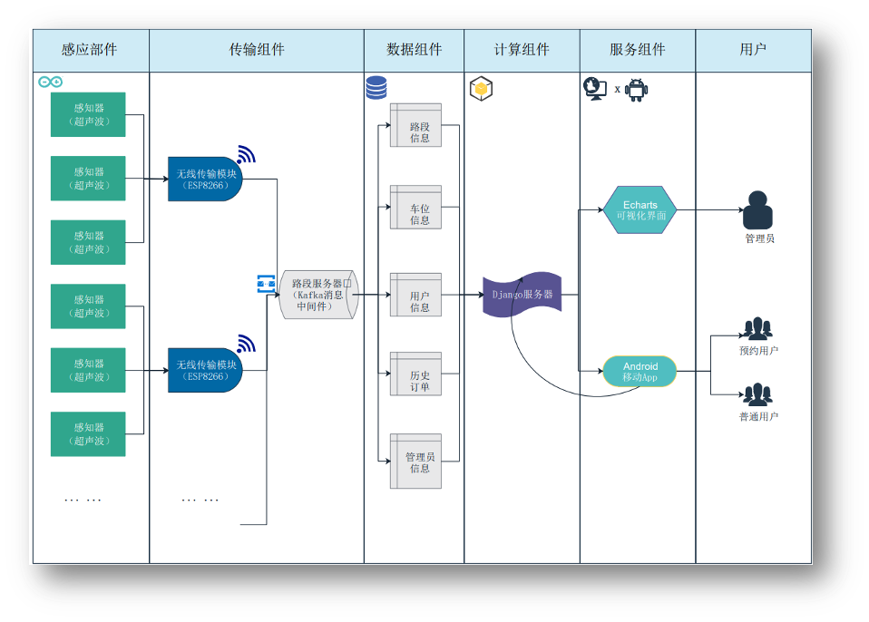

E-Parking is a Smart parking device and application based on the internet of things (IoT) for parking management system suitable for areas with tight parking resources.

* **Position:** Team Leader
* **Duration:** Sep, 2020 - Sep, 2022
* **Supervisor:**  Prof. [Dr Zhao Dong](https://scholar.google.com/citations?hl=en&user=jZghsyQAAAAJ) & Assoc. Prof. [Dr Wang Pengfei](https://scholar.google.com/citations?hl=en&user=BEDKYxUAAAAJ) 
* **Main Contribution:**
  * Completed BP in cooperation with members from economics.
  * Used Arduino to complete hardware and set up the back end of the project using Django.
  * Led a team of more than 20 people and distributed work among them & helped them on demand.

Abstract
======
With the continuous growth of population and vehicles in many cities, people face more serious "difficult parking" problems. At the same time, many parking spaces have not been fully utilized. This product aims to establish a set of users and urban management departments for urban parking resources shortage area parking management system. Our goal is to provide parking space prediction and reservation allocation functions for users with parking needs, to help users better plan their trips, improve their parking efficiency, and solve the problem of difficult parking. It provides intelligent pricing and visual data analysis functions for urban management departments to help them understand the use of parking resources in time, scientifically price according to parking demand, and improve parking management levels.

This project uses the complementary product model of Web end and Android user end to provide technical support for the four target service objects of government decision-making departments, traffic management departments, private enterprises, and individual car owners.

Based on building the Internet of Things of edge facilities, this project collects and classifies the parking data, so that it can be displayed on the visual interface in an intuitive and clear form, providing higher quality transportation services for managers and decision-makers, to realize more fine operation management. The city management department can respond according to the system's reaction to the occupancy of parking Spaces and the prediction results of parking peaks, dispatch more police in advance in the areas that may be congested, unblock the congestion, and effectively avoid the occurrence of accidents, to alleviate the severe situation of parking difficulties and management difficulties, and improve the sense of gain and happiness of the people. This is of great significance for improving people's livelihood projects.

* **Overall Structure**

* **Predict Algorithm**

* **Web Frontend**

* **Android Frontend**

Link
======
[GitHub.com](https://github.com/cn-jackie/kuaiyi)

[Business Plan (in Chinese)](https://jackie4zjq.github.io/files/Business_Plan.pdf)

[Promotional Video (in Chinese)](https://jackie4zjq.github.io/files/Adv_Video.mp4)

