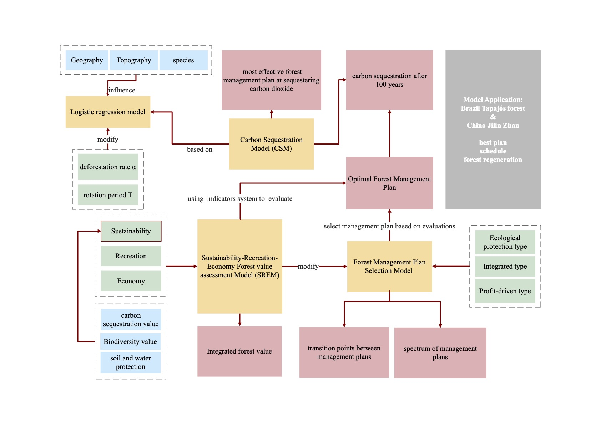

Analyzed the Brazilian data and simulated the post-cutting growth of the woods using a Lotka-Volterra model, which 
was further extended to northwest China to derive the most environmentally beneficial cutting plan.

* **Position:** Team Leader
* **Duration:** Jan, 2022 - Mar, 2022
* **Supervisor:** Asst. Prof. Dr Li Yajie
* **Main Contribution:**
  * Performed data cleaning & visualization to find unique insights & patterns from the data.
  * Implemented model using Python and typeset the paper in LaTeX. 
  * Modeled the growth of trees during rotation. 

  

Abstract
======
We first developed a carbon sequestration (CS) model based on rotation period and felling
ratio to determine the most efficient way to sequester CO2. Considering other values of the
forest, we developed a Sustainability-Recreation-Economy (SRE) forest value assessment model
to calculate the total forest value. And the indicator weights of the SRE model are different
according to different forest managers. Then, we modified the SRE model to determine the
spectrum of each forest management plan and the transition points between them. We also
applied the CS and SRE models to the Tapajós forest in Brazil to see how well the models
worked. Finally, we modified the SRE model to remove the deforestation rate factor to evaluate
the current state of the forest. Based on the evaluation and the needs of managers and users,
an optimal forest management plan was proposed. The plan includes a deforestation rate ff, a
rotation period T, measures to regenerate the forest, and a timeline. The CS model also predicts
the amount of CO2 sequestered in the forest in 100 years.

* **Overall Structure**
  

* **Forest Integrated Value**

* **The effect of rotation period and harvesting rate on carbon sequestration**

Link
======
[GitHub.com](https://github.com/cn-jackie/2022MCM)

[Academic Paper](https://jackie4zjq.github.io/files/model.pdf)

