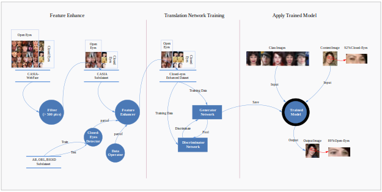

Developed an unsupervised image-to-image translation method based on the GAN framework designed to complete the image conversion task of face image processing. 

* **Position:** Researcher
* **Duration:** Sep, 2022 - Jul, 2023
* **Supervisor:**  Asst. Prof. [Dr Changjae Oh](http://eecs.qmul.ac.uk/~coh/) 

* **Main Contribution:**
  * Surveyed & published papers in the field of style transfer such as GAN, cycleGAN, UNIT & FUNIT. 
  * Optimized the network structure of FUNIT and applied it to the field of face image manipulation. 

Abstract
======
In recent years, Generative Adversarial Networks have been widely used in the field of image-to-image translation with 
promising results. However, most of the existing work has focused on animal images. This paper proposes an advanced
approach to face image processing using feature enhancers and translation networks for closed human eye restoration.
The unique network structure allows the model to perform the task in a few-shot scenario. Empirical evidence validates
that the approach proposed in this paper yields favorable outcomes in this domain.

* **Overall Structure**

* **Network**

* **Result**

